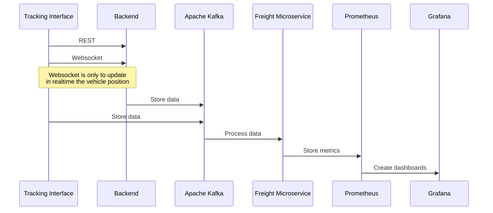

# Vehicle Tracking System

## Dinâmica do sistema

```mermaid
sequenceDiagram
  participant TI as Tracking Interface
  participant B as Backend
  participant AK as Apache Kafka
  participant F as Freight Microservice
  participant P as Prometheus
  participant G as Grafana

  TI->>B: REST
  TI->>B: Websocket
  Note over TI,B: Websocket is only to update <br> in realtime the vehicle position 

  B->>AK: Store data
  TI->>AK: Store data

  AK->>F: Process data
  F->>P: Store metrics 
  P->>G: Create dashboards
```

## Backend

